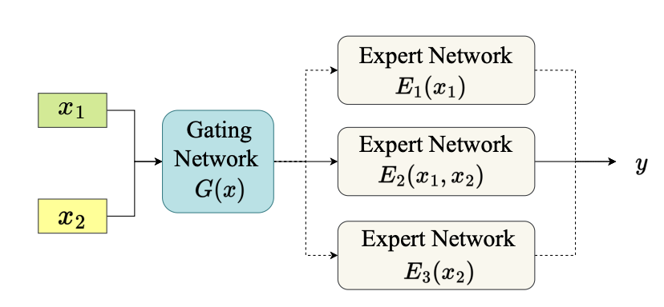
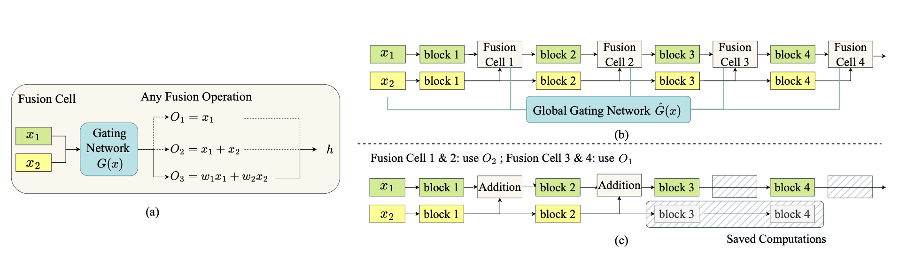

# Dynamic Multimodal Fusion

[**Dynamic Multimodal Fusion**](https://arxiv.org/abs/2204.00102)  
Zihui Xue, Radu Marculescu  
6th Multi-Modal Learning and Applications Workshop (MULA), CVPR 2023

### Modality-level DynMM


#### Overview
Task: (1) Movie Genre Classification on MM-IMDB; (2) Sentiment Analysis on CMU-MOSEI  
Modality: (1) image, text; (2) video, audio, text  
We adapt the [Multibench codebase](https://github.com/pliang279/MultiBench/tree/main/) to enable a modality-level DynMM, which makes sample-wise decisions on which modality to adopt.

#### Setup
(1) Download MM-IMDB and CMU-MOSEI data from [Multibench](https://github.com/pliang279/MultiBench).  
(2) Clone the Multibench repository.  
(3) Copy folders from `ModalityDynMM` to `MultiBench`

#### Training
Step I: train expert networks, model checkpoints will be saved in `./log/imdb` and `./log/mosei`.
```bash
### MM-IMDB

# Expert network 1: text
python examples/multimedia/imdb_uni.py  
# Expert network 2: image + text late fusion
python examples/multimedia/imdb_mm.py --fuse 1 


### CMU-MOSEI

# Expert network 1: text transformer
python examples/affect/affect_uni.py

# Expert network 2: video + audio + text transformer late fusion
python examples/multimedia/imdb_mm.py --fusion 3
```

Step II: train modality-level DynMM
```bash
### MM-IMDB
python examples/multimedia/imdb_dyn.py (--freeze) (--hard-gate) --reg $reg_loss_ratio

### CMU-MOSEI
python examples/affect/affect_dyn.py (--freeze) (--hard-gate) --reg $reg_loss_ratio
```
`freeze` controls whether to freeze the weights of the expert networks during training, `hard-gate` decides whether to use hard gates or soft gates during training, and `reg_loss_ratio` corresponds to `lambda` in Equation (1) of the paper. 

### Fusion-level DynMM


#### Overview
Task: Indoor Semantic Segmentation on NYU Depth V2  
Modality: RGB images, depth images  
We adapt the [ESANet codebase](https://github.com/TUI-NICR/ESANet) to design a fusion-level DynMM, enabling more fine-grained input-dependent decision making during the inference process.

#### Setup
Follow ESANet to build conda environments and process data
```
# change the directory
cd FusionDynMM

# set up the envrionment
conda env create -f rgbd_segmentation.yaml
conda activate rgbd_segmentation

# process data
cd src/datasets/nyuv2
pip install -r ./requirements.txt
python prepare_dataset.py ../../../datasets/nyuv2
```

#### Training
Training logs and model checkpoints can be found [here](https://drive.google.com/drive/folders/1267tmiVlQXziR694JKkQDrVeQBU_XU_e?usp=sharing). Download them to skip the training process and proceed directly to the evaluation step.

General training command:
```shell
python train.py --dynamic --global-gate --loss-ratio $loss_ratio \
                --temp $start_temp --end_temp $end_temp \
                --epoch_ini $epoch_ini --epoch_hard $epoch_hard 
```
Best config (`temp1-0.001-loss1e-4-inifromhard` from training logs):
```shell
python train.py --dynamic --global-gate --loss-ratio 1e-4 --eval-every 1 \
                --finetune results/nyuv2/hard-loss1e-4/ckpt_best.pth \
                --temp 1.0 --end-temp 0.001 \
                --epoch_ini 0 --epoch_hard 500 
``` 

#### Evaluation
(1) Regular setting (Table 3 in the paper)
```shell
# Baseline (static ESANet), mIoU = 50.28
python eval.py --dynamic --global-gate --baseline --hard \
               --ckpt_path results/nyuv2/baseline/ckpt_best.pth 
               
# Ours (Fusion-level DynMM), mIoU = 50.98 along with fewer computations
python eval.py --dynamic --global-gate --hard \
               --ckpt_path results/nyuv2/temp1-0.001-loss1e-4-inifromhard/ckpt_best.pth 
```

(2) Robustness results (Fig. 6-7 in the paper)

Add random Gaussian noise to RGB / depth images: 
```shell
# Baseline (static ESANet)
python eval.py --dynamic --global-gate --baseline --hard \
               --num_runs 10 --mode $mode --noise $noise_level \
               --ckpt_path results/nyuv2/baseline/ckpt_best.pth 
               
# Ours (Fusion-level DynMM)
python eval.py --dynamic --global-gate --hard \
               --num_runs 10 --mode $mode --noise $noise_level \
               --ckpt_path results/nyuv2/temp1-0.001-loss1e-4-inifromhard/ckpt_best.pth 
```

`mode`: 0-only add noise to RGB images; 1-only add noise to depth images; 2-add noise to both modalities  
`noise_level`: 0-1, control the variance of Gaussian noise

<br>

If you find this repository useful, consider citing our paper:
```
@inproceedings{xue2022dynamic,
  title={Dynamic multimodal fusion},
  author={Xue, Zihui and Marculescu, Radu},
  booktitle={Multi-Modal Learning and Applications Workshop (MULA), CVPR},
  year={2023}
}
```